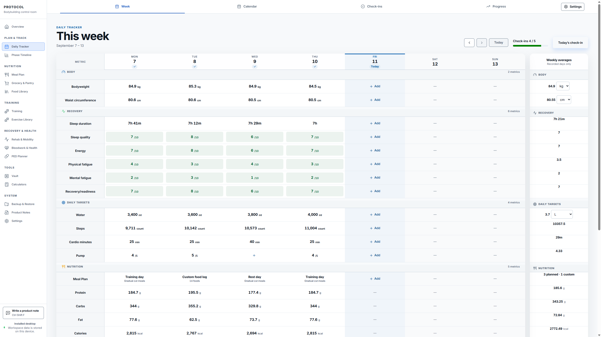
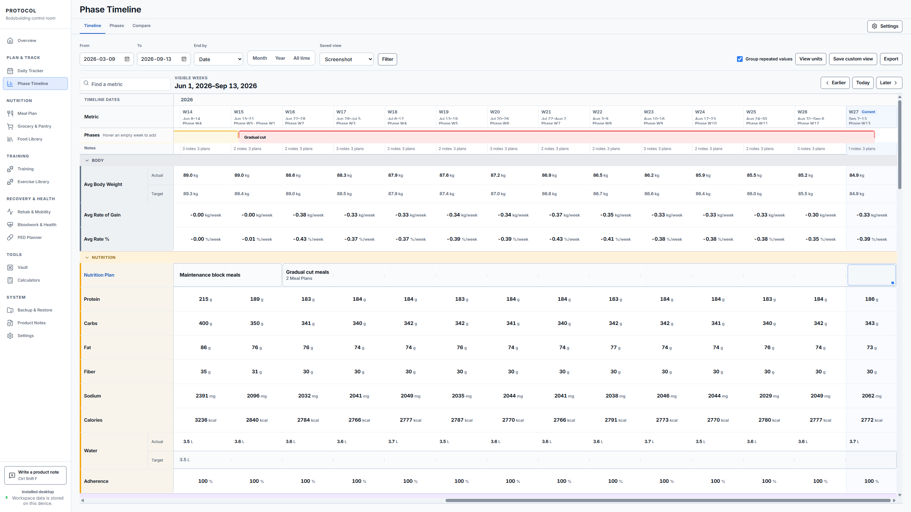

# PROTOCOL Community

PROTOCOL is a free Windows app for keeping your bodybuilding plans and progress
in one place. Track your training, food, bodyweight, check-ins, photos, recovery,
health, and more, without spreading everything across different apps.

No ads, subscriptions, or account required. It works offline, and your records
stay on your own device.

[Download PROTOCOL for Windows](https://github.com/KadenB20/PROTOCOL-Community/releases)

For the **0.10.0 Windows installer**. [Scan details](verification/0.10.0.md).
For checks covering other versions, see [release verification](RELEASE-CHECKS.md).

**Windows may show a warning or block the download.** It can't currently verify
the app's publisher. If your antivirus reports a threat, leave the file blocked
and [report it](SUPPORT.md). Don't turn off your protection to install PROTOCOL.
[Help with Windows warnings](DOWNLOAD-SAFETY.md).

[What's included](#whats-included) · [Install or update](#install-or-update) ·
[About the creator](#about-the-creator)

## A look inside

Track your day, then look back across the weeks and phases.

The screenshots use made-up example data, not anyone's personal records or
recommended targets. [Getting started](GETTING-STARTED.md).

## What's included

### Daily Tracker and Calendar

- Record bodyweight, sleep, steps, cardio, water, nutrition, and health readings.
- Keep track of appetite, digestion, energy, stress, motivation, muscle soreness,
  pain, and how training felt.
- Review the week in one grid, compare your targets with what you recorded, and
  open an earlier day to add or correct an entry.
- Choose units for your measurements and reuse a meal plan across selected dates.
- Use the Calendar to browse your records and planned schedules by date. Keep
  daily and weekly notes alongside the numbers.

### Check-ins and questionnaires

- Create your own weekly, monthly, quarterly, or annual check-in forms.
- Combine written questions, numbers, rating scales, yes/no answers, and choices
  with results from your tracked data.
- Save an unfinished check-in, return to it later, and review previous answers.
  Keep notes on how the week went, what you want to change, and what to check next.

### Phase Timeline

- Organise cuts, gaining phases, maintenance, or other blocks with their own dates,
  goals, and notes.
- See bodyweight, nutrition, training, activity, recovery, and selected health
  records together, week by week.
- Set weekly targets and keep your meal and training plans beside your results.
  Add notes about changes, travel, illness, or anything else that affected a week.
- Compare phases, choose which rows and dates to show, save different Timeline
  views, and export the period you want to review.
- Set targets or choose plans for several weeks at once, check the changes before
  saving, and undo them if needed. Each target keeps the units you entered.

### Meal plans and nutrition

- Build reusable meal plans with the foods, portions, and meal order you want.
  Duplicate days, reuse saved meals, and swap foods as your plan changes.
- See calories, protein, carbs, fat, fibre, sodium, and other recorded nutrients
  for each food, meal, and day. Compare the plan with your own nutrition targets.
- Keep different plans for different days, add an optional schedule, and choose
  the plan you used in Daily Tracker. Record meals as planned or adjust them to
  reflect what you actually ate.

### Food Library

- Search and browse the built-in food catalogue, including raw and cooked options,
  different cuts, and food varieties.
- Save your own foods with their label values, serving sizes, brands, prices,
  and notes. Keep the specific foods you eat available for meals and shopping.
- Use grams, millilitres, or your own serving sizes. See where a food's nutrition
  information came from. Editing a saved food won't change meals you've already logged.

### Grocery lists

- Start a blank shopping list or build one from your meal plans for a chosen date
  range. Add other shopping items directly to the list, too.
- Allow for food already in your Pantry, amounts you want to keep, and whole
  package sizes. Save your own conversions, such as how much dry rice makes a
  cooked portion.
- Organise shopping by aisle, store, or category. Record full or partial purchases,
  unavailable items, prices, taxes, discounts, and other costs. When buying a food
  from your Food Library, check how much will be added to Pantry before saving it.

### Pantry

- Keep track of the food you have, how much is left, where it's stored, and when
  it expires. Keep separate entries for different packages or batches.
- See what is running low, expiring soon, expired, or used up. Set how much of a
  food you want to keep on hand and add shortages to a grocery list.
- Add purchases or existing stock, record what you used or discarded, correct an
  amount, move several entries, and review the history. When logging meals,
  check the amounts before taking them out of your Pantry totals.

### Training programs and workout logbook

- Build your own split from a blank program or an editable outline such as
  Push / Pull / Legs, Upper / Lower, or Full Body. Add workout days and an optional
  schedule.
- Set exercises, sets, reps, loads, and rest. Add supersets, warm-up and back-off
  sets, tempo, effort targets, progression details, and notes when you need them.
- Log a completed workout from a program, a previous workout, or a blank entry.
  Record loads, reps, set types, effort, and notes with previous performance nearby.
  The logbook is designed to be filled in after training; it isn't a live workout timer.
- Save drafts, copy workouts, and correct completed records without losing the
  original history. Changes to today's program do not rewrite older workouts.

### Training Progress

- Review sessions, working sets, reps, volume, and recorded effort over a selected
  date range.
- Follow exercise performance, estimated one-rep maxes, personal records, and
  muscle-group set totals.
- Compare periods and programs, find unfinished logs, and open the original
  workout to check or correct an entry.

### Exercise Library

- Browse the built-in exercise library with illustrations, instructions, equipment,
  and muscle information, including when you are offline.
- Search by exercise, muscle, or equipment; keep favourites; and add your own
  exercises, variations, technique notes, images, and videos.
- Use saved exercises in programs and workout records, find alternatives when
  changing a movement, and review an exercise's own performance history.
- Bring in exercise lists and check their details and files before saving them.
  Choose which exercises to include when exporting a list.

### Rehab and mobility

- Organise mobility, activation, warm-up, and rehab routines by name and body area.
  Build them from your own movements or the Movement Library.
- Log completed work with as little as a name and date. Add sets, reps, time,
  movement notes, or how it felt when that detail is useful.
- Keep recovery notes, follow-ups, and movement assessments, including pain and
  range-of-motion measurements.
- Look back at completed routines and compare measurements over time.

### Bloodwork and health

- Record blood pressure, resting heart rate, glucose, and other health readings
  with dates, units, notes, and measurement details.
- Enter bloodwork results or import them from a file. Attach the original report
  and keep the lab's reference ranges, units, and flagged results.
- Follow changes across tests and choose which markers to review. Add custom
  bloodwork markers when you need something outside the built-in list.
- Keep symptom episodes, medication details, monitoring plans, and follow-up dates
  together. Return to unfinished entries and see earlier corrections.

### PED Planner

- Create and reuse your own cycles, with the PEDs, amounts, units, and schedules
  you enter. Browse the reference catalogue or add custom entries.
- Save product strengths, package sizes, and prices. Estimate quantities,
  containers, and costs for a chosen period, with the calculation details visible.
- Assign cycles to weeks in Phase Timeline and inspect the planned dates and
  amounts in Calendar. Keep weekly notes with those assignments.
- This section is optional. You'll need to read and accept its safety notice
  before using it. It doesn't recommend PED use, doses, combinations, or schedules.

### Calculators

- Estimate body fat from tape or skinfold measurements, and calculate fat mass,
  lean mass, BMI, waist ratios, FMI, and FFMI.
- Compare resting-energy formulas, estimate total daily energy expenditure, review
  weight-change rates, and calculate a goal weight from the assumptions you enter.
- Estimate a one-rep max and work out plate or machine-stack loading using saved
  equipment details.
- Save results to compare later, with the measurements and formulas used to
  calculate them. Running a calculator won't change your meal plans or targets.

### Vault: photos, documents, and links

- Keep progress photos, lab reports, reference documents, and useful website links
  together in your local Vault.
- Add names, tags, notes, and favourites; preview supported files; and link them to
  the relevant records in PROTOCOL.
- Keep earlier file versions, archive items, and check for missing or changed files.

### Your workspace, settings, and backups

- Choose the sections, fields, and extra tools you want to see. Hiding an optional
  feature keeps its saved records and settings.
- Customise your Overview with the information you want to review, keep tasks and
  notes, and choose your units, time zone, currency, and light or dark appearance.
- Back up your records and check that a backup can be opened without replacing
  your current data. Export records from supported sections and check what's
  included before saving the file.
- Keep personal notes and prepare problem reports or suggestions in Product Notes.
  From 0.10.1, add screenshots and optional technical details, then review and
  share the report through GitHub. [Reporting instructions](SUPPORT.md).
- Check for new releases manually or turn on optional update notices.

## Install or update

Download the Windows installer from the
[latest release](https://github.com/KadenB20/PROTOCOL-Community/releases/latest)
and open it. [Installation instructions](INSTALL.md).

Already using PROTOCOL? Back up your records, close the app, and run the newer
installer in the same location. **Don't uninstall first.** Your saved records
are kept separately from the app.

In **Settings → Workspace & Data → About PROTOCOL**, you can check for updates or
turn on update notices. You choose when to download and install them. PROTOCOL
won't install an update or restart itself while you're using it.

## Before you start

- You'll need a Windows PC. Installation may need an internet connection to
  download a required Windows component. See [system requirements](INSTALL.md#requirements).
- The app works offline after installation. Optional online food and exercise
  lookups, update checks, and web links need an internet connection.
- Keep your records and backups somewhere private. Anyone with access to the files
  may be able to read them. [Privacy details](PRIVACY.md).
- Use **Backup & Restore** to keep a separate copy of your progress.
- Health and PED sections record information and plans you enter. They do not
  recommend treatment, PED use, or doses.

## About the creator

Hi, my name's Kaden, and I love bodybuilding.

Like most other bodybuilders, I really enjoy the workouts, the diet, the lifestyle,
and obviously making progress. But what I really love is data — more specifically,
tracking all of the data related to my bodybuilding progress so I can make accurate
and informed decisions for myself and my clients.

Over the years I tried all kinds of different coaching and tracking systems like
Kahunas, Trainerize, Hevy, and plenty of others. Eventually, like a lot of people,
I ended up using a bunch of different apps and systems at the same time. I had one
app to track and plan my workouts, another to record my daily weigh-ins, I created
my meal plans in MyFitnessPal and wrote them down on paper, uploaded my check-in
photos to a Google Drive folder, and then, to top it all off, manually combined all
of that data into a spreadsheet so I could actually track everything and plan
around it.

It worked, but it took forever.

I'd miss weigh-ins, forget meal amounts or changes I'd made to my meal plan, lose
track of what was stored where, and constantly run into tons of other frustrating
little problems that I really shouldn't have had to think about in the first place.

That's why I created PROTOCOL.

I wanted one place where I could track the things that actually matter to me as a
bodybuilder — training, nutrition, bodyweight, progress photos, recovery, health
data, bloodwork, phases, PED plans, and everything else — without needing five
different apps, three subscriptions, a spreadsheet, and a pile of notes to make
it all work together.

And because I built PROTOCOL to solve a problem I personally had, I don't want to
turn around and recreate the same problems that frustrated me in the first place.

That's why PROTOCOL Community is free, and why I want this version and its future
updates to stay completely free. No ads. No subscriptions. No tracking. No account,
login, or email required. It works offline, and your records stay on your own device.

It's the bodybuilding tracking system I always wanted to have, so I decided to
build it.

[Installation and recovery](INSTALL.md) · [Privacy](PRIVACY.md) ·
[Free use licence](LICENSE.md) · [Credits](THIRD-PARTY-NOTICES.md) ·
[Get help](SUPPORT.md)

Exercise data by [RepDB](https://repdb.co). Food reference data includes the Canadian
Nutrient File under the Open Government Licence Canada.
